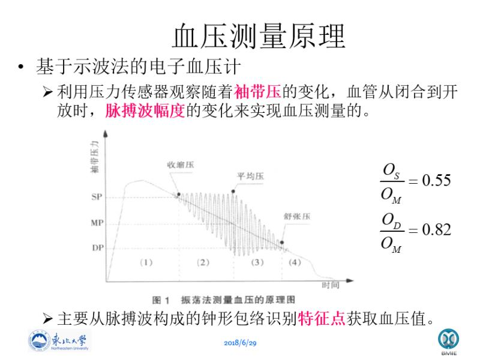
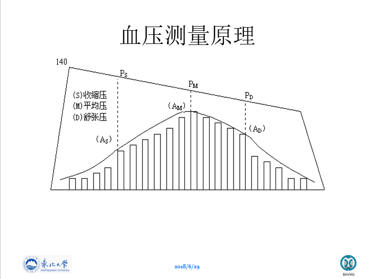
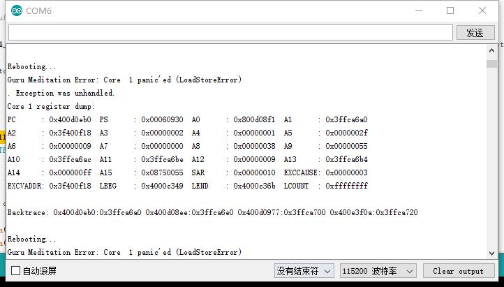
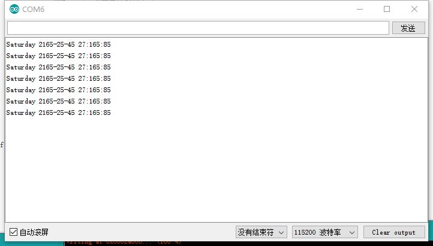
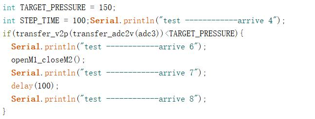
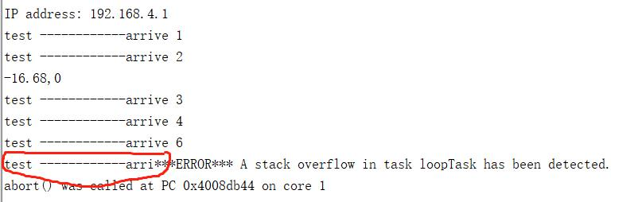
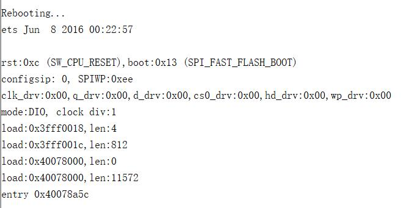

# Bloody_pressure_monitor
一个电子血压计的开源项目。
***
| 组成 | 型号 | 注释 | 
| :-: | :-: | :-: | 
| 单片机 | ESP32 | 这个芯片有好多的名字 我们选用的是没有显示器的那种 | 
| ADC | ADS1115 | i2c通讯 | 
| 显示器 | ssd1306 | 我们用的是很小的，好像是0.96寸的 如果要用的话建议带一个放大镜 或者直接多花点钱买个大的 |
| 电机驱动板 | LN298 | 并行口通讯 分别控制 [充气泵开启+缓慢放气阀关闭]  以及 [快速放气气阀打开] |
| 气泵 | 不知型号 | 在某宝上搜索鱼缸换气泵 |
| 放气阀1 | 不知型号 | 不通电为常开状态，用于缓慢放气 与气泵并联使用  |
| 放气阀2 | 不知型号 | 不通电为常闭状态，用于快速放气 |
| 放大滤波电路 | 基于LM324 | 巴特沃斯高通/低通滤波器 截止频率分别为0.5Hz 10Hz |
***
## 单片机的选择
最开始我们选择的是ESP8266。ESP8266 HDK (Hardware Development Kits) 包括芯片 ESP8266EX、模组 ESP-WROOM-02 和开发板 ESP-LAUNCHER等。

我们在设计时预计在单片机上搭建一个网站，可以通过手机或者电脑进行连接，从而获取患者当前以及历史血压信息。该单片机上搭载WIFI模块，可实现网站的搭建从而达到上述目的。但我们在后期的测试使用过程中发现，该单片机的性能稍差，无法实现多台设备同时连入WIFI，而且运算速度较慢。我们更换了类似但性能更强的单片机。所以我们选择了ESP32。

ESP32可通过 SPI / SDIO 或 I2C / UART 接口提供WIFI和蓝牙功能；具有高水平的低功耗性能，包括精细分辨时钟门控、省电模式和动态电压调整等。ESP32 将天线开关、RF balun、功率放大器、接收低噪声放大器、滤波器、电源管理模块等功能集于一体。而且该单片机社区庞大，有很多的源码和技术支持。我们也最终选择这款单片机。

## 时钟信号的处理
从网络获取时间

## 充放气
我们有两套放气装置，其中一个是快速放气阀，处于常闭状态，仅在测量结束后快速放气；另一个是缓慢放气阀，处于常开状态，仅在充气时关闭。

首先是充气和缓慢放气。我们首先通过气泵对整个袖带在内的封闭模块进行充气，同时通过压力传感器对袖带内气压进行监控。当气压达到某个值之后，关闭气泵同时打开缓慢放气。（为了方便调试也为减少被测对象的压力痛苦，我们将阈值调到160毫米汞柱，通过对水银血压计的观察，最大值达到300毫米汞柱，感觉这种压强会死。）在缓慢放气这个过程中通过示波法对血压进行测量计算。

在数据足够计算血压之后，开启快速放气阀，直至结束。

## 血压的测量
目前大多数电子血压计都是基于振荡法原理,即对动脉施加缓慢变化的压力(此压力称之为静压)在此过程中,提取由于血管搏动而叠加在静压之上的微弱的压力变化信号。一般情况下这个脉动信号的外包络线类似于抛物线形,如图1。包络线的峰值位置所对应的静压为平均压,包络的峰值乘以特定的比例系数,获得收缩压和舒张压在包络线上的特征点,这两个特征点对应于静压变化曲线上的2点之值,即收缩压和舒张压。

## 遇到的问题
### 时钟问题
首先我们时钟芯片选用了DS1302，其中软件部分尝试了多个库以及相关代码，但总体上遇到了如下两类问题

我们通过对输出端口的修改曾经成功显示时间，但是在添加其他模块之后又回滚到如上两图的问题。最终我们放弃了时钟芯片的安装调试，选用互联网时间校准来完成这一部分的工作。

### 可能是显示芯片的问题
调试代码：

错误提醒（红色部分是打印一半死掉了）：

甚至前一天能跑的代码都报错了：

在尝试一万次删代码之后，依然没有解决这些报错的问题。最终的解决办法就是重构。

### 走线问题
这一看就有问题👇

我们有好多线甚至还是杜邦线插的，并没有焊接起来。还有那个红色板子是电机驱动。因为需要他的时候比较着急，直接拿了个220V的驱动。重焊计划换一下电机驱动，然后电线全部焊上去，最后让原件紧密一些，更加小型化。

再或者听James的建议，直接套上一个壳子。