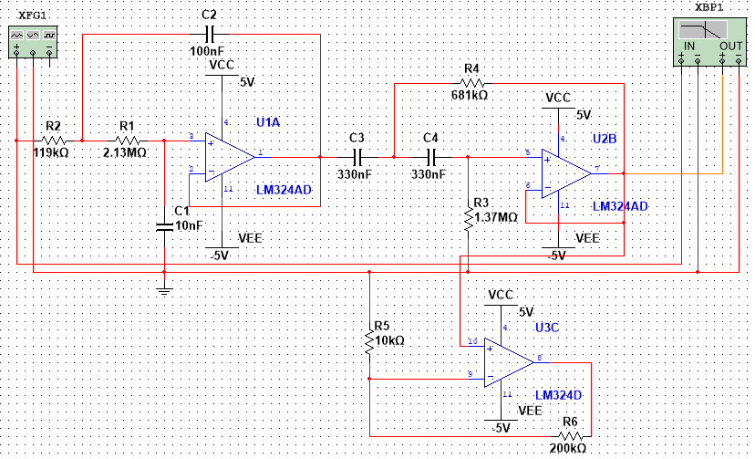
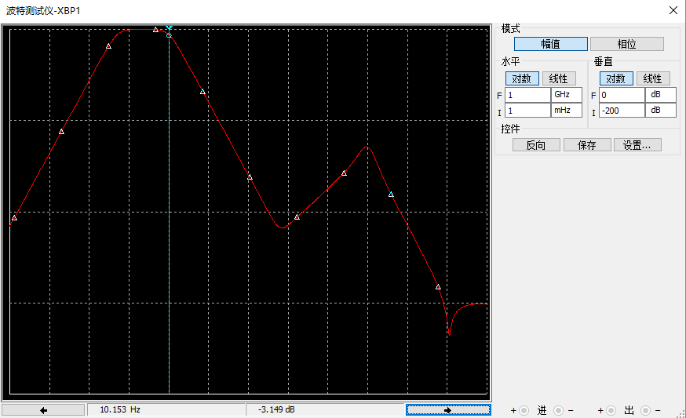
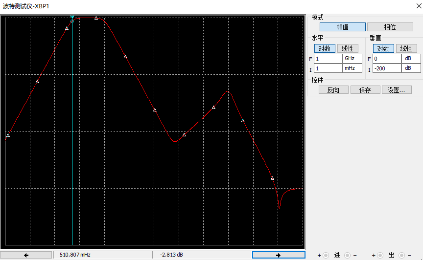

# analog circuit design

We used the MPX5050GP model pressure sensor. The pressure signal from the pressure sensor can be directly used as the current blood pressure value. The pulse wave signal obtained from this simulation circuit is used to find the corresponding systolic pressure and diastolic pressure.

